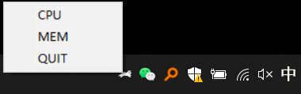
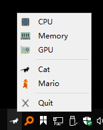

# Ref

[RunCat](http://kyomesuke.com/runcat/index.html) 是一款 mac应用，用奔跑的猫来显示当前系统资源（CPU）占用情况。

Windows 版本 也发布了，[RunCat for win](https://github.com/Kyome22/RunCat_for_windows) 为 ， 基于C#。

可以直接用 scoop 安装： `scoop install runcat`。

# runcat-pyqt-win
这里用python撸了一个，在windows任务栏（通知区域）养猫。

首先用[psutil](https://pypi.org/project/psutil/)
获得CPU或内存的使用情况，然后用pyqt5创建QSystemTrayIcon显示在任务栏的托盘区域。

GPU使用情况可以用[nvidia-ml-py](https://pypi.org/project/nvidia-ml-py/)
的pynvml模块（仅限nvidia gpu）。

## Screenshot

## Requirements
- psutil
- pyqt5
- nvidia-ml-py

## Usage

- 直接clone， 改 *.pyw 运行

- ~~或者下载打包后的程序[下载7z](https://github.com/shenbo/runcat-pyqt5-win/releases)~~  

> ref:
> - https://github.com/Kyome22/menubar_runcat
> - https://github.com/Kyome22/RunCat_for_windows
> - https://github.com/sunthx/RunCat-Win

## Versions

V1.0 @ runcat by pyqt6. 
  icon 直接用 base64 转换

V0.6 @ runcat by pystray
  

V0.5 @ runcat by pystray test

V0.4 @ runcat by infi.systray

V0.3 @ runcat-v0.3.py
- add context menu
  - change monitor type： [cpu, memory, gpu]
   
    

V0.2 @ runcat-v0.2-cpu-mario.py
- add context menu
  - change icon type: [runcat, mario]
  - quit 
- add mario icons 

V0.1 @ runcat-v0.1-cpu.py, runcat-v0.1-memory.py, runcat-v0.1-gpu.py
- runcat @ cpu 
- runcat @ memory 
- runcat @ gpu
